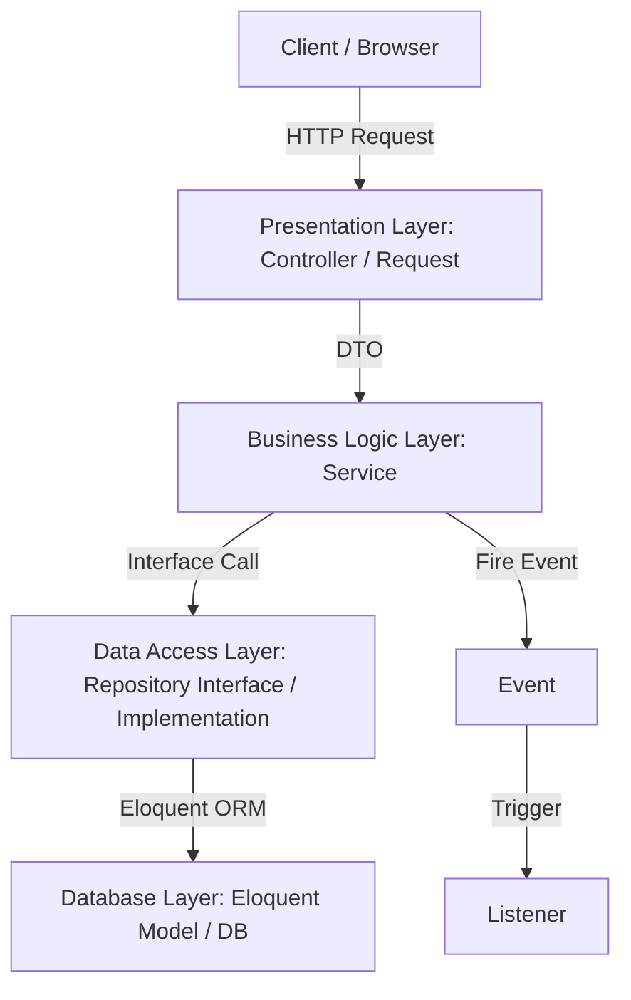

# Quy tắc & Chỉ dẫn Dự án (DATN - EduFlow)

> [!IMPORTANT]
> Đây là tài liệu quy tắc được tải tự động bởi Developer Agent of Google Antigravity ngay đầu mỗi phiên làm việc tại dự án này để hướng dẫn các quyết định kiến trúc, lập trình, cấu trúc thư mục, và phong cách thiết kế UI/UX.

---

## 1. Cấu trúc Thư mục Dự án

Dự án EduFlow là một ứng dụng Web tích hợp kiểu **Monolith hiện đại**, kết hợp sức mạnh của **Laravel 12 (Backend)** và **ReactJS (Frontend)** thông qua giao thức **InertiaJS**. Cấu trúc thư mục chi tiết như sau:

### 1.1. Cấu trúc Backend (`app/`, `routes/`, `database/`)
* **`app/DTO/`**: Chứa các lớp Data Transfer Objects (ví dụ: `App\DTO\Seller\Course\CourseData`), sử dụng cấu trúc `readonly class` của PHP 8.2+ để định hình, chuyển đổi dữ liệu từ Request (`fromRequest`) trước khi truyền qua Service.
* **`app/Enums/`**: Chứa các PHP Enum để quản lý các giá trị hằng số cố định (ví dụ: `UserRole.php` quản lý vai trò và logic phân quyền/redirect route).
* **`app/Events/` & `app/Listeners/`**: Quản lý kiến trúc hướng sự kiện (Event-Driven Architecture). Khi một hành động xảy ra (ví dụ: `UserRegistered`), Laravel sẽ kích hoạt các listeners tương ứng (`CreateUserWallet`, `GenerateFirstSession`) để giữ cho các nghiệp vụ độc lập, rời rạc (decoupled).
* **`app/Http/`**: Chứa Controllers, Middleware, Form Requests.
  * **Controllers**: Được chia theo các nhóm nghiệp vụ (`Auth/`, `Frontend/`, `Seller/`). Controllers chỉ làm nhiệm vụ điều phối (nhận Request, gọi Service, và trả về Response/Inertia view).
* **`app/Models/`**: Chứa các Eloquent Models đại diện cho 30+ thực thể cơ sở dữ liệu (`User`, `Course`, `Lesson`, `Wallet`, `Coupon`, v.v.).
* **`app/Providers/`**: Chứa các Service Providers. Tất cả các Repository Interface được bind cụ thể với Concrete Repository trong `AppServiceProvider.php`.
* **`app/Repositories/`**: Thực hiện **Repository Pattern** để trừu tượng hóa các câu lệnh Eloquent ORM. Chia thành các thư mục con theo domain (`Auth/`, `Frontend/`, `Seller/`, `User/`). Mỗi nhóm chức năng gồm một Interface (ví dụ: `CourseRepositoryInterface.php`) và một class cụ thể triển khai Interface đó (ví dụ: `CourseRepository.php`).
* **`app/Services/`**: Chứa tầng logic nghiệp vụ chính (Business Logic). Controller gọi đến Service, và Service sẽ sử dụng các Repository tương ứng để thao tác với DB.
* **`routes/`**:
  * `web.php`: Khai báo toàn bộ định tuyến giao diện người dùng và Admin/Seller. Nhóm Front-end (khách) nằm trong prefix `/tech-education`, nhóm Seller nằm trong prefix `/seller` (bảo vệ bởi `role:seller,admin,root`).
* **`quy tắc đặt đường dẫn`**:
* cái gì use được ở đầu thì use không được kiểu App\... trong function
### 1.2. Cấu trúc Frontend (`resources/js/`)
Toàn bộ mã nguồn Frontend nằm trực tiếp trong thư mục `resources/js/` của dự án Laravel:
* **`Pages/`**: Chứa các trang React chính được render qua InertiaJS.
  * `Pages/Frontend/`: Các trang giao diện công khai như Trang chủ (`Home/`), Danh sách khóa học (`Course/`), Giảng viên (`Instructor/`), Giỏ hàng (`Cart/`), v.v.
  * `Pages/Seller/`: Giao diện Dashboard và các trang quản trị của Giảng viên (Danh sách khóa học, Bài học, Video, Câu hỏi trắc nghiệm, Doanh thu, Đánh giá).
  * `Pages/Auth/` & `Pages/Profile/`: Các trang xác thực và quản lý tài khoản cá nhân.
* **`Components/`**: Chứa các thành phần UI dùng chung, độc lập và có khả năng tái sử dụng (Buttons, Modals, Forms, Inputs, Cards).
* **`Layouts/`**: Các Layout bao bọc cấu trúc chung của trang:
  * `FrontendLayout.jsx`: Dành cho giao diện khách hàng học viên (chứa Header, Footer, Thanh tìm kiếm).
  * `SellerLayout.jsx`: Dành cho trang quản lý của giảng viên (chứa Sidebar điều hướng, Topbar thông tin).
* **`app.jsx`**: Điểm khởi đầu của ứng dụng React, thiết lập Inertia App.
* **`bootstrap.js` & `ziggy.js`**: Thiết lập Axios và hỗ trợ gọi route Laravel bằng tên trực tiếp trong JS.

---

## 2. Kiến trúc Hệ thống & Các Mẫu Thiết kế Cốt lõi

Hệ thống của EduFlow được thiết kế dựa trên sự kết hợp chặt chẽ giữa **Kiến trúc Phân tầng (Layered Architecture)**, mô hình **Monolith hiện đại với InertiaJS**, cùng các mẫu thiết kế bổ trợ là **Event-Driven Architecture** và **DTO Pattern**.

### 2.1. Cốt lõi: Kiến trúc Phân tầng (Layered Architecture)
Hệ thống Backend được phân chia thành 4 tầng cô lập rõ ràng để đảm bảo khả năng mở rộng, bảo trì và kiểm thử dễ dàng:
1. **Presentation Layer (Tầng Hiển thị / Điều phối)**:
   * Chứa các **Controllers** và **Form Requests**.
   * Nhiệm vụ duy nhất: Tiếp nhận HTTP Request từ Client, thực hiện validation cơ bản, khởi tạo đối tượng **DTO** và truyền dữ liệu xuống tầng dưới (Service). 
   * Trả về phản hồi HTML (thông qua Inertia) hoặc JSON API.
2. **Business Logic Layer (Tầng Nghiệp vụ)**:
   * Chứa các **Services** (nằm trong `app/Services/`).
   * Là nơi tập trung xử lý toàn bộ logic nghiệp vụ, tính toán, và điều phối quy trình làm việc.
   * Giao tiếp với tầng trên qua **DTO** để đảm bảo không phụ thuộc trực tiếp vào đối tượng HTTP Request của Laravel.
   * Giao tiếp với tầng dưới thông qua **Repository Interface**.
3. **Data Access Layer (Tầng Truy cập Dữ liệu)**:
   * Thực hiện thông qua **Repository Pattern** (Interface và Concrete Class trong `app/Repositories/`).
   * Giúp che giấu và cô lập chi tiết triển khai truy vấn cơ sở dữ liệu. Mọi thay đổi về cách lấy dữ liệu (ví dụ: chuyển từ Eloquent sang Query Builder hoặc cache Redis) đều chỉ thay đổi ở tầng này mà không ảnh hưởng tới tầng nghiệp vụ.
4. **Database Layer (Tầng Cơ sở Dữ liệu)**:
   * Đại diện bởi các **Eloquent Models** (trong `app/Models/`) và cơ sở dữ liệu vật lý.



### 2.2. Mô hình Monolith tích hợp qua InertiaJS
* Thay vì phân tách thành hai dự án độc lập (Frontend SPA riêng và Backend API riêng), dự án sử dụng mô hình **Monolith hiện đại**.
* **InertiaJS** hoạt động như một chất keo kết dính, cho phép sếp viết giao diện hoàn toàn bằng **React** nhưng vẫn sử dụng cơ chế định tuyến (routing), middlewares, và xác thực (session auth) trực tiếp từ **Laravel**.
* Dữ liệu được đẩy thẳng từ Controller vào React Components qua props mà không cần thiết lập các API endpoints công khai phức tạp hay quản lý state phức tạp ở client.

### 2.3. Kiến trúc hướng sự kiện (Event-Driven Architecture)
* Dự án sử dụng hệ thống **Events & Listeners** của Laravel để giảm tải cho luồng nghiệp vụ chính và tăng độ lỏng lẻo trong liên kết (decoupling).
* Các tác vụ mang tính chất phụ trợ, không bắt buộc xử lý đồng bộ trong cùng một transaction (ví dụ: tạo ví mới khi đăng ký tài khoản, ghi log đăng nhập, gửi email, cấp token) phải được chuyển sang dạng sự kiện (Events) để các Listeners tương ứng lắng nghe và xử lý riêng biệt.

### 2.4. DTO Pattern (Data Transfer Object)
* Toàn bộ dữ liệu truyền từ tầng điều phối (Controller) xuống tầng nghiệp vụ (Service) phải được đóng gói qua các **DTO** (sử dụng các `readonly class` của PHP 8.2+).
* Điều này giúp định hình dữ liệu đầu vào một cách tường minh, loại bỏ hoàn toàn việc truyền các mảng thô (`array`) khó kiểm soát kiểu dữ liệu hoặc truyền trực tiếp đối tượng HTTP Request của Laravel xuống các tầng dưới.

### Các nguyên tắc hệ thống bắt buộc:
1. **Cô lập các tầng**: Tầng trên chỉ được gọi trực tiếp tầng ngay dưới nó (Controller gọi Service, Service gọi Repository Interface).
2. **Không viết logic nghiệp vụ (business logic) hoặc truy vấn DB trong Controller**: Controller chỉ làm nhiệm vụ điều phối và chuyển giao dữ liệu.
3. **Không gọi trực tiếp Model từ Controller**: Mọi thao tác ghi/đọc dữ liệu phải đi qua Service và Repository.
4. **Trừu tượng hóa Data Access**: Phải luôn tạo Repository Interface và đăng ký liên kết (bind) trong `AppServiceProvider.php` trước khi sử dụng.
5. **Kiểm soát dữ liệu thông qua DTO**: Sử dụng `readonly class` DTO để định dạng dữ liệu đầu vào cho các Service, loại bỏ sự phụ thuộc vào dữ liệu thô (raw array) hoặc HTTP Request.
6. **Kiến trúc hướng sự kiện (Event-Driven)**: Tách biệt các tác vụ phụ trợ (như tạo ví học viên, ghi nhật ký, gửi mail) ra ngoài tầng nghiệp vụ chính bằng cách phát ra các **Events** và xử lý qua **Listeners**.
7. **Kiểm soát Race Condition**: Bắt buộc sử dụng khóa bi quan (`lockForUpdate()`) trong Database Transaction khi thực hiện các tác vụ liên quan đến tài chính, rút tiền, hoặc cập nhật số dư ví để tránh lỗi double-spending do request đồng thời.
8. **Kiểu dữ liệu tiền tệ**: Tuyệt đối không dùng `FLOAT` hay `DOUBLE` để lưu dữ liệu tiền tệ. Bắt buộc dùng `DECIMAL(15,2)` hoặc lưu đơn vị nhỏ nhất bằng kiểu `BIGINT` để tránh sai số thập phân.
9. **Caching bắt buộc cho Scale (Redis)**: Các query nặng (ví dụ: lấy danh sách khóa học có lượng truy cập lớn ở Trang chủ, `ORDER BY`) phải được lưu trữ Cache bằng Redis. Chỉ load lại từ DB khi có thay đổi dữ liệu liên quan.

---

## 3. Phong cách Thiết kế Web & Quy chuẩn UI/UX (Frontend Styling)

Giao diện của EduFlow được thiết kế theo phong cách **hiện đại, trực quan, chuyên nghiệp và đầy sức sống (Premium Design Aesthetics)**.

### 3.1. Framework Layout & CSS
* **Sử dụng Bootstrap 5**: Kết hợp hệ thống Grid, Flexbox và Utilities của Bootstrap 5 (`container`, `row`, `col-*`, `d-flex`, `align-items-center`, v.v.) để dựng bố cục nhanh và đáp ứng tốt trên di động (Responsive Layout).
* **Custom CSS tại `resources/css/frontend.css`**: Chứa toàn bộ các định nghĩa thiết kế riêng và định hình thương hiệu.
* **TUYỆT ĐỐI KHÔNG SỬ DỤNG TAILWIND CSS**:
  - Không viết code dạng Tailwind utility class trong giao diện để tránh xung đột trầm trọng về CSS Reset với Bootstrap 5.
  - Các tệp cấu hình Tailwind CSS hiện tại trong dự án chỉ mang tính chất phụ trợ hoặc đã bị vô hiệu hóa tại `app.css`. Tất cả thiết kế giao diện đều sử dụng class của Bootstrap 5 và custom class trong `frontend.css`.

### 3.2. Hệ màu sắc chuẩn (Color Palette)
Hệ thống sử dụng các biến CSS (`:root`) thống nhất tại `resources/css/frontend.css` hoặc qua các custom classes:
* **Màu Cam Chủ Đạo (Primary Fire)**: 
  - `--fire: #EA580C;` (Màu cam đậm phong cách công nghệ năng động).
  - Tương tác Hover: `#C2410C` (Màu cam sẫm hơn).
  - Nền nhạt: `#fff7ed` (Cho các vùng kích hoạt hoặc hover menu con).
* **Màu Nhấn phụ (Secondary Accent)**:
  - `--accent: #0284C7;` (Màu xanh dương bầu trời mang lại cảm giác tin cậy, tri thức).
  - Tông xanh nhạt: `--accent-dim: #E0F2FE;`.
* **Màu sắc Hệ thống & Nền**:
  - `--bg-main: #FFFFFF;` (Mền chính sáng).
  - `--bg-surface`: `#F8F9FA;` & `--bg-surface-alt`: `#F1F5F9;` (Nền xám nhạt phân tách thẻ).
  - `--border`: `#E5E7EB;` (Màu đường viền mỏng thanh lịch).
  - `--text-main`: `#1F2937;` (Chữ chính màu xám đậm gần đen giúp dễ đọc).
  - `--text-muted`: `#4B5563;` (Chữ mô tả, chữ phụ).

### 3.3. Các Quy tắc UI Premium
1. **Bo góc lớn (Rounded Corners)**: Thẻ khóa học, nút bấm, ảnh banner đều có bo góc tròn mềm mại (`border-radius: var(--radius);` tương đương `8px` hoặc `12px` tùy kích cỡ).
2. **Tiêu điểm Tiêu chuẩn (Focus States)**: Các ô nhập liệu (inputs, textareas) khi được chọn (focus) bắt buộc phải có viền phát sáng màu cam thương hiệu (`.orange-input-focus` hoặc `border-color: var(--fire)`).
3. **Hiệu ứng mượt mà (Micro-animations)**: Mọi trạng thái di chuột (Hover) lên nút, khóa học, liên kết menu đều phải cài đặt chuyển động mượt mà thông qua `transition: var(--transition);` (`all 0.2s ease-in-out`).
4. **Xử lý Ảnh Lỗi (Fallback Images)**: 
  - Không sử dụng các đường link ảnh không ổn định bên ngoài. Mọi hình ảnh mặc định phải lưu cục bộ trong `public/assets/frontend/img/`.
  - Luôn cài đặt sự kiện `onError` dự phòng trên thẻ `img` để chuyển đổi sang ảnh mặc định khi xảy ra lỗi tải ảnh:
    ```jsx
    onError={(e) => { e.target.src = "/assets/frontend/img/default-course.png"; }}
    ```

---

## 4. Quy định làm việc & Giao tiếp dành cho Agents

> [!CAUTION]
> Tuân thủ các quy tắc này là bắt buộc để giữ tiến độ dự án ổn định và đúng văn hóa giao tiếp.

* **Cách xưng hô bắt buộc**: Trong mọi phản hồi và câu thoại đối thoại với sếp (User), luôn bắt đầu bằng: **"Em chào sếp, em xin phép phản hồi..."** hoặc các câu xưng hô thể hiện sự kính trọng, lễ phép tương tự.
* **Quy tắc về Git**: **TUYỆT ĐỐI KHÔNG** tự ý chạy các lệnh `git commit`, `git push` hoặc tự động triển khai mã lên Github. Chỉ được thực hiện commit/push khi sếp đưa ra yêu cầu rõ ràng bằng lời nói (Ví dụ: *"commit và push code lên github cho tao"*).
* **Định dạng file trả về**: Khi sửa đổi hoặc hoàn thành các chức năng, hãy liệt kê danh sách các tệp đã cập nhật ở cuối phản hồi. Mỗi tệp phải là một liên kết click được theo định dạng: `[tên_file.ext](file:///C:/VsCode/DATN/backend-api/...)` (sử dụng đường dẫn tuyệt đối với dấu gạch chéo `/`).
* **Không để lại mã giả lập (No placeholders)**: Khi viết code, luôn hoàn thành các hàm và giao diện đầy đủ chức năng, không viết mã mẫu bị cắt xén, không để lại comment `// TO-DO: implement later` trừ khi có hướng dẫn cụ thể.

---

## 5. Danh sách các Pattern & Kỹ thuật trọng tâm

### 5.1. Repository Pattern (Mẫu thiết kế Kho lưu trữ)
* **Vị trí**: Nằm trong thư mục `Repositories`.
* **Chi tiết**: Tách biệt phần truy vấn dữ liệu khỏi tầng nghiệp vụ bằng cách tạo ra các Interfaces (ví dụ: `CourseRepositoryInterface.php`) và các lớp triển khai thực tế (Concrete class như `CourseRepository.php`). Điều này giúp dễ dàng thay đổi thư viện truy vấn hoặc cấu trúc DB mà không ảnh hưởng đến tầng Service.

### 5.2. Dependency Injection / IoC Container (Tiêm phụ thuộc)
* **Vị trí**: Rải rác khắp các Controllers và Services, cũng như việc đăng ký binding trong `AppServiceProvider.php`.
* **Chi tiết**: Laravel tự động phân giải các class. Ví dụ, trong `CourseController`, inject `CourseService` vào hàm constructor. Trong `CourseService`, lại tiếp tục inject `CourseRepositoryInterface`. Điều này giúp code lỏng lẻo (loose coupling) và dễ viết Unit Test.

### 5.3. Data Transfer Object - DTO Pattern (Mẫu chuyển đối dữ liệu)
* **Vị trí**: Thư mục `DTO` (ví dụ: `CourseData.php`).
* **Chi tiết**: Dùng các `readonly class` để đóng gói dữ liệu đầu vào. Việc định rõ các thuộc tính giúp kiểm soát dữ liệu nghiêm ngặt khi chuyển tiếp từ tầng Controller sang tầng Service thay vì dùng mảng thô (raw array).

### 5.4. Observer / Event-Driven Pattern (Mẫu người quan sát / Hướng sự kiện)
* **Vị trí**: Thư mục `Events` và `Listeners`.
* **Chi tiết**: Khi một sự kiện xảy ra (ví dụ: `UserRegistered`), hệ thống sẽ phát tín hiệu (Notify) cho nhiều đối tượng khác lắng nghe (`CreateUserWallet`, `GenerateFirstSession`) để tự động thực thi mà không làm phình luồng xử lý của hàm đăng ký gốc.

### 5.5. Active Record Pattern (Mẫu bản ghi hoạt động)
* **Vị trí**: Thư mục `Models`.
* **Chi tiết**: Đây là mẫu mặc định của Laravel Eloquent ORM. Mỗi Model tương ứng trực tiếp với một hàng trong bảng cơ sở dữ liệu (ví dụ: `Course.php` đại diện cho bảng `courses`), chứa cả dữ liệu và các phương thức truy vấn/lưu trữ dữ liệu đó.

### 5.6. Facade Pattern (Mẫu mặt tiền)
* **Vị trí**: Rải rác khắp dự án (ví dụ: các lệnh gọi static như `Route::get`, `Event::listen`, `Category::where`, `Inertia::render`).
* **Chi tiết**: Cung cấp một giao diện tĩnh (static interface) đơn giản cho một hệ thống con phức tạp bên dưới Service Container của Laravel, giúp code ngắn gọn và dễ đọc hơn.

### 5.7. Static Factory Method (Phương thức nhà máy tĩnh)
* **Vị trí**: Bên trong các lớp DTO (ví dụ: hàm `fromRequest` ở `CourseData.php`).
* **Chi tiết**: Thay vì gọi trực tiếp `new CourseData(...)`, sếp cung cấp một phương thức tĩnh `fromRequest` đóng vai trò là một nhà máy nhỏ để tạo và trả về chính instance của lớp đó dựa trên tham số đầu vào.

### 5.8. Model Factory Pattern (Mẫu nhà máy dữ liệu mẫu)
* **Vị trí**: Thư mục `database/factories/`.
* **Chi tiết**: Dùng để sinh nhanh hàng loạt dữ liệu mẫu (mock data) phục vụ cho seeding cơ sở dữ liệu và viết Test case.

### 5.9. Pipeline Pattern (Mẫu đường ống)
* **Vị trí**: Thư mục `app/Services/Payment/Pipes/` và class `PaymentService`.
* **Chi tiết**: Chia nhỏ một quy trình xử lý phức tạp (như thanh toán) thành nhiều bước (Pipes) độc lập nối tiếp nhau. Dữ liệu (DTO) sẽ chảy qua từng Pipe. Giúp code tuân thủ Single Responsibility, dễ dàng thêm/bớt các bước xử lý (ví dụ: áp dụng coupon, tạo đơn, tính tiền) mà không làm phình to một God Method, đồng thời vẫn giữ được tính toàn vẹn của một Database Transaction.


> [!NOTE]
> **Lưu ý Đặc biệt từ Sếp:** Cái nào hay, được sếp kêu note lại thì bắt buộc phải ghi (append) vào file `C:\VsCode\DATN\backend-api\.agents\thesis_notes.md` để sếp làm luận án tốt nghiệp. **TUYỆT ĐỐI KHÔNG ĐƯỢC XÓA** nội dung cũ trong file đó, chỉ được thêm nội dung mới vào cuối.