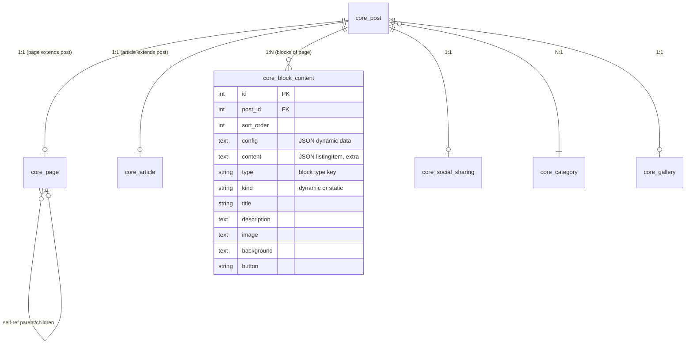

# CMS Page Block - Kế Hoạch Triển Khai Chi Tiết

## Goal Description

Xây dựng lại hệ thống CMS dạng Page-Block cho dự án Laravel hiện tại (`backend-api`), dựa trên kiến trúc đã phân tích kỹ từ dự án tham chiếu `ismart2026 - backup` (Symfony). Hệ thống cho phép Admin quản lý các trang (Page) với nội dung được cấu thành từ nhiều khối (Block) có thể kéo-thả sắp xếp, chỉnh sửa nội dung realtime, và quản lý thư viện media.

### Tóm tắt kiến trúc gốc (ismart2026)



**Nghiệp vụ cốt lõi:**
1. **Post** là entity trung tâm chứa metadata chung (title, slug, published, tags)
2. **Page** mở rộng Post bằng cách liên kết 1:1, thêm metadata riêng (name, type, css, seo_url)
3. **Block** liên kết N:1 với Post, mỗi block là 1 section/khối của trang
4. Block có 2 loại: **Dynamic** (tạo mới tùy ý) và **Static** (block cố định được đồng bộ across pages)
5. Block dùng **hybrid storage**: cột SQL cho properties cố định + cột `content` (JSON) cho dữ liệu động (listingItem, nested config)
6. **BlockDTO** map request data → entity properties + merge vào JSON content

---

## User Review Required

> [!IMPORTANT]
> **Về cấu trúc đã có sẵn**: Dự án hiện tại **đã có** Models, Migrations, Controllers, Services, Repositories, và DTO cho CMS (CorePost, CorePage, CoreBlockContent). Kế hoạch này sẽ **bổ sung và hoàn thiện** dựa trên những gì đang thiếu so với ismart2026, chứ KHÔNG phải viết lại từ đầu.

> [!WARNING]  
> **Về BlockDTO logic**: Dự án ismart2026 dùng `BlockDTO::run()` rất phức tạp — nó iterate qua tất cả properties của DTO, check xem property có setter riêng (cho JSON merge) hay dùng setter của entity (cho SQL column). Logic này cần được port sang Laravel một cách rõ ràng hơn.

> [!IMPORTANT]
> **Về block_type config**: Dự án ismart2026 có file `config/block_type.config.yaml` (~26KB) định nghĩa ~35 loại block khác nhau. Mỗi loại block map với `backend view` (form chỉnh sửa) và `frontend view` (hiển thị). Dự án hiện tại cần tạo file `config/cms_blocks.php` tương tự nhưng map sang React components (Inertia).

---

## Phân Tích So Sánh: Hiện Tại vs Cần Làm

| Component | Hiện Tại (Laravel) | ismart2026 (Symfony) | Cần Bổ Sung |
|---|---|---|---|
| **Database/Migrations** | ✅ Đã có đầy đủ core_post, core_page, core_block_content, galleries, menu, settings | ✅ Đầy đủ | ❌ Không cần thêm migration |
| **Models** | ✅ CorePost, CorePage, CoreBlockContent, CoreArticle + relationships | ✅ Entity + Traits | ⚠️ Cần thêm `content` cast JSON cho CoreBlockContent |
| **PageController** | ✅ CRUD cơ bản + Inertia | ✅ CRUD + DataTables | ⚠️ Cần thêm duplicate page, toggle publish |
| **BlockController** | ✅ CRUD + reorder | ✅ CRUD + sort + edit-by-property + add-item + sync static | ❌ Thiếu: edit-by-property, add-item, add-static-block, sync static blocks |
| **BlockDTO** | ❌ Không có | ✅ BlockDTO với run() method phức tạp | ❌ Cần tạo mới |
| **BlockService** | ✅ Cơ bản | ✅ + syncSameTypeBlocks | ❌ Thiếu: sync static, add item, edit property |
| **Block Type Config** | ⚠️ `config('cms_blocks')` được reference nhưng chưa có file | ✅ block_type.config.yaml (~35 types) | ❌ Cần tạo config/cms_blocks.php |
| **Media Library** | ✅ CoreGallery, CorePicture models + migrations | ✅ MediaLibraryController, GalleryController | ❌ Cần tạo MediaController + Service |
| **Frontend Rendering** | ❌ Chưa có | ✅ Twig templates per block type | ❌ Cần tạo React components per block type |
| **Static Block Sync** | ❌ Chưa có | ✅ BlockService::syncSameTypeBlocks | ❌ Cần implement |

---

## Proposed Changes

### Phase 1: Backend Core — Block DTO & Enhanced Block Logic

#### [NEW] `app/DTO/CMS/BlockData.php`
DTO mới port từ ismart2026 `BlockDTO`, thích ứng cho Laravel.

```php
<?php

namespace App\DTO\CMS;

use App\Models\CoreBlockContent;
use Illuminate\Http\Request;

readonly class BlockData
{
    public function __construct(
        public ?string $title = null,
        public ?string $sub_title = null,
        public ?string $description = null,
        public ?string $content = null,        // JSON string for nested content merge
        public ?int $sort_order = null,
        public ?string $background = null,
        public ?string $mobile_background = null,
        public ?string $image = null,
        public ?string $image_mobile = null,
        public ?string $image_icon = null,
        public ?string $text_icon = null,
        public ?string $url = null,
        public ?string $video_url = null,
        public ?string $location = null,
        public ?string $config = null,          // JSON string
        public ?string $listing_item = null,    // JSON string for listingItem merge
        public ?string $listing_item_extra = null,
        public ?string $button = null,
        public ?string $extra = null,           // JSON "meta.title" style nested update
        public ?string $thumbnail = null,
        public ?string $status = null,
        public ?string $type = null,
        public ?string $kind = null,
        public ?string $language = null,
    ) {}

    public static function fromRequest(Request $request): self
    {
        return new self(
            title: $request->input('title'),
            sub_title: $request->input('sub_title'),
            description: $request->input('description'),
            content: $request->input('content'),
            sort_order: $request->input('sort_order'),
            background: $request->input('background'),
            mobile_background: $request->input('mobile_background'),
            image: $request->input('image'),
            image_mobile: $request->input('image_mobile'),
            image_icon: $request->input('image_icon'),
            text_icon: $request->input('text_icon'),
            url: $request->input('url'),
            video_url: $request->input('video_url'),
            location: $request->input('location'),
            config: $request->input('config'),
            listing_item: $request->input('listing_item'),
            listing_item_extra: $request->input('listing_item_extra'),
            button: $request->input('button'),
            extra: $request->input('extra'),
            thumbnail: $request->input('thumbnail'),
            status: $request->input('status'),
            type: $request->input('type'),
            kind: $request->input('kind'),
            language: $request->input('language'),
        );
    }

    /**
     * Port của BlockDTO::run() từ ismart2026
     * Map SQL columns trực tiếp, merge JSON content thông minh
     */
    public function applyTo(CoreBlockContent $block): CoreBlockContent
    {
        // 1. Map SQL column properties trực tiếp
        $directProps = [
            'title', 'sub_title', 'description', 'sort_order',
            'background', 'mobile_background', 'image', 'image_mobile',
            'image_icon', 'text_icon', 'url', 'video_url', 'location',
            'button', 'thumbnail', 'status', 'type', 'kind', 'language',
        ];

        foreach ($directProps as $prop) {
            if ($this->{$prop} !== null) {
                $block->{$prop} = $this->{$prop};
            }
        }

        // 2. Merge config (JSON)
        if ($this->config !== null) {
            $block->config = json_decode($this->config, true) ?? $this->config;
        }

        // 3. Merge content (JSON) — port từ BlockDTO::setContent()
        if ($this->content !== null) {
            $newData = json_decode($this->content, true);
            if ($newData !== null) {
                $existing = is_string($block->content) 
                    ? (json_decode($block->content, true) ?? []) 
                    : ($block->content ?? []);
                foreach ($newData as $key => $val) {
                    $existing[$key] = is_string($val) ? trim($val) : $val;
                }
                $block->content = json_encode($existing, JSON_UNESCAPED_UNICODE);
            }
        }

        // 4. Merge listingItem — port từ BlockDTO::setListingItem()
        if ($this->listing_item !== null) {
            $this->mergeListingData($block, 'listingItem', $this->listing_item);
        }

        // 5. Merge listingItemExtra
        if ($this->listing_item_extra !== null) {
            $this->mergeListingData($block, 'listingItemExtra', $this->listing_item_extra);
        }

        // 6. Merge extra (dot-notation nested update) — port từ BlockDTO::setExtra()
        if ($this->extra !== null) {
            $this->mergeExtraData($block, $this->extra);
        }

        return $block;
    }

    /**
     * Merge listing data vào content JSON
     * Port từ BlockDTO::setListingItem() / setListingItemExtra()
     */
    private function mergeListingData(CoreBlockContent $block, string $key, string $jsonData): void
    {
        $data = json_decode($jsonData, true);
        if ($data === null) return;

        $content = is_string($block->content)
            ? (json_decode($block->content, true) ?? [])
            : ($block->content ?? []);

        if (!isset($content[$key])) {
            $content[$key] = [];
        }

        foreach ($data as $index => $val) {
            if (isset($val['merge']) && $val['merge'] === true) {
                unset($val['merge']);
                $oldItemData = $content[$key][$index] ?? [];
                $content[$key][$index] = array_merge($oldItemData, $val);
            } else {
                $content[$key][$index] = $val;
            }
        }

        $block->content = json_encode($content, JSON_UNESCAPED_UNICODE);
    }

    /**
     * Merge extra data với dot-notation key
     * Port từ BlockDTO::setExtra()
     * VD: extra = {"meta.title": "New Title"} -> content.meta.title = "New Title"
     */
    private function mergeExtraData(CoreBlockContent $block, string $jsonData): void
    {
        $extraData = json_decode($jsonData, true);
        if (empty($extraData)) return;

        $content = is_string($block->content)
            ? (json_decode($block->content, true) ?? [])
            : ($block->content ?? []);

        foreach ($extraData as $fullKey => $value) {
            $parts = explode('.', $fullKey, 2);
            if (count($parts) < 2) continue;
            [$parentKey, $childKey] = $parts;
            $content[$parentKey][$childKey] = $value;
        }

        $block->content = json_encode($content, JSON_UNESCAPED_UNICODE);
    }
}
```

---

#### [MODIFY] `app/Models/CoreBlockContent.php`
Thêm `content` cast JSON và helper methods.

```diff
 protected $casts = [
     'config' => 'array',
+    'content' => 'array',
 ];

+    /**
+     * Lấy danh sách listing items từ content JSON
+     */
+    public function getListingItems(): array
+    {
+        $content = is_array($this->content) ? $this->content : [];
+        return $content['listingItem'] ?? [];
+    }
+
+    /**
+     * Clone block cho sync static blocks
+     * Port từ Block::__clone() + toArrayForSync()
+     */
+    public function toSyncArray(): array
+    {
+        return [
+            'title' => $this->title,
+            'description' => $this->description,
+            'image' => $this->image,
+            'image_mobile' => $this->image_mobile,
+            'background' => $this->background,
+            'mobile_background' => $this->mobile_background,
+            'content' => $this->content,
+            'url' => $this->url,
+            'location' => $this->location,
+            'video_url' => $this->video_url,
+        ];
+    }
```

---

### Phase 2: Enhanced Block Service & Repository

#### [MODIFY] `app/Repositories/CMS/Block/BlockRepositoryInterface.php`
Thêm methods mới theo ismart2026.

```diff
 interface BlockRepositoryInterface
 {
     public function getBlocksByPageId(int $pageId): Collection;
     public function store(array $data, int $postId): CoreBlockContent;
     public function findById(int $id): ?CoreBlockContent;
     public function update(CoreBlockContent $block, array $data): CoreBlockContent;
     public function delete(CoreBlockContent $block): void;
     public function updateSortOrders(array $sortData): void;
+
+    /**
+     * Tìm tất cả static blocks cùng type trên các page khác
+     */
+    public function findSameTypeStaticBlocks(string $type, int $excludeId): Collection;
+
+    /**
+     * Thêm 1 item mới vào listingItem trong content JSON
+     */
+    public function addListingItem(CoreBlockContent $block, array $itemData): CoreBlockContent;
+
+    /**
+     * Xóa 1 item khỏi listingItem theo index
+     */
+    public function removeListingItem(CoreBlockContent $block, int $index): CoreBlockContent;
+
+    /**
+     * Update 1 property đơn lẻ (hoặc nested key trong content JSON)
+     */
+    public function updateProperty(CoreBlockContent $block, string $property, mixed $value): CoreBlockContent;
 }
```

#### [MODIFY] `app/Repositories/CMS/Block/BlockRepository.php`
Implement các methods mới.

```php
public function findSameTypeStaticBlocks(string $type, int $excludeId): Collection
{
    return CoreBlockContent::where('type', $type)
        ->where('kind', 'static')
        ->where('id', '!=', $excludeId)
        ->get();
}

public function addListingItem(CoreBlockContent $block, array $itemData): CoreBlockContent
{
    $content = is_array($block->content) ? $block->content : [];
    
    if (!isset($content['listingItem'])) {
        $content['listingItem'] = [];
    }
    
    $content['listingItem'][] = $itemData;
    $block->content = $content;
    $block->save();
    
    return $block;
}

public function removeListingItem(CoreBlockContent $block, int $index): CoreBlockContent
{
    $content = is_array($block->content) ? $block->content : [];
    
    if (isset($content['listingItem'][$index])) {
        array_splice($content['listingItem'], $index, 1);
        $block->content = $content;
        $block->save();
    }
    
    return $block;
}

public function updateProperty(CoreBlockContent $block, string $property, mixed $value): CoreBlockContent
{
    // Check nếu property là SQL column
    if (in_array($property, $block->getFillable())) {
        $block->{$property} = $value;
        $block->save();
        return $block;
    }
    
    // Nếu không, treat như nested key trong content JSON
    $content = is_array($block->content) ? $block->content : [];
    $parts = explode('.', $property, 2);
    
    if (count($parts) === 2) {
        $content[$parts[0]][$parts[1]] = $value;
    } else {
        $content[$property] = $value;
    }
    
    $block->content = $content;
    $block->save();
    
    return $block;
}
```

#### [MODIFY] `app/Services/CMS/BlockService.php`
Thêm business logic mới.

```php
use App\DTO\CMS\BlockData;

/**
 * Đồng bộ nội dung static block cùng type trên tất cả pages
 * Port từ ismart2026 BlockService::syncSameTypeBlocks()
 */
public function syncStaticBlocks(CoreBlockContent $sourceBlock): void
{
    if ($sourceBlock->kind !== 'static') {
        return;
    }

    $sameTypeBlocks = $this->blockRepository
        ->findSameTypeStaticBlocks($sourceBlock->type, $sourceBlock->id);

    $syncData = $sourceBlock->toSyncArray();
    
    foreach ($sameTypeBlocks as $block) {
        $block->update($syncData);
    }
}

/**
 * Thêm static block (block cố định) vào trang
 * Port từ ismart2026 BlockController::addStaticBlock()
 */
public function addStaticBlockToPage(int $pageId, string $blockType): CoreBlockContent
{
    $page = CorePage::findOrFail($pageId);
    $typeConfig = config("cms_blocks.{$blockType}");
    
    $existingBlock = CoreBlockContent::where('type', $blockType)
        ->where('kind', 'static')
        ->first();
    
    $data = [
        'type' => $blockType,
        'kind' => 'static',
        'title' => $typeConfig['name'] ?? $blockType,
        'status' => 'active',
    ];
    
    if ($existingBlock) {
        $data = array_merge($data, $existingBlock->toSyncArray());
    }
    
    return $this->blockRepository->store($data, $page->post_id);
}

/**
 * Update block với DTO và tự động sync nếu là static block
 */
public function updateBlockWithDTO(int $id, BlockData $dto): CoreBlockContent
{
    $block = $this->blockRepository->findById($id);
    $dto->applyTo($block);
    $block->save();
    
    $this->syncStaticBlocks($block);
    
    return $block;
}

/**
 * Thêm item vào listingItem trong content
 */
public function addItemToBlock(int $blockId, array $itemData): CoreBlockContent
{
    $block = $this->blockRepository->findById($blockId);
    return $this->blockRepository->addListingItem($block, $itemData);
}

/**
 * Xóa item khỏi listingItem
 */
public function removeItemFromBlock(int $blockId, int $index): CoreBlockContent
{
    $block = $this->blockRepository->findById($blockId);
    return $this->blockRepository->removeListingItem($block, $index);
}

/**
 * Update 1 property đơn lẻ (inline edit)
 */
public function updateBlockProperty(int $id, string $property, mixed $value): CoreBlockContent
{
    $block = $this->blockRepository->findById($id);
    $updated = $this->blockRepository->updateProperty($block, $property, $value);
    
    $this->syncStaticBlocks($updated);
    
    return $updated;
}
```

---

### Phase 3: Enhanced Block Controller

#### [MODIFY] `app/Http/Controllers/CMS/BlockController.php`
Thêm endpoints mới theo ismart2026.

```php
use App\DTO\CMS\BlockData;

/**
 * Update block sử dụng BlockData DTO (full update)
 * Port từ ismart2026 POST /cms/block/update/{id}
 */
public function updateWithDTO(Request $request, $id)
{
    $dto = BlockData::fromRequest($request);
    $this->blockService->updateBlockWithDTO($id, $dto);

    return redirect()->back()->with('success', 'Cập nhật Block thành công!');
}

/**
 * Update 1 property đơn lẻ (inline edit / edit-by-property)
 * Port từ ismart2026 /cms/block/edit/by-property/{id}
 */
public function updateProperty(Request $request, $id)
{
    $request->validate([
        'property' => 'required|string',
        'value' => 'nullable',
    ]);

    $block = $this->blockService->updateBlockProperty(
        $id,
        $request->input('property'),
        $request->input('value')
    );

    return response()->json([
        'message' => 'Cập nhật property thành công!',
        'block' => $block
    ]);
}

/**
 * Thêm static block vào page
 * Port từ ismart2026 /cms/block/add-static-block/{pageId}
 */
public function addStaticBlock(Request $request, $pageId)
{
    $request->validate([
        'type' => 'required|string',
    ]);

    $this->blockService->addStaticBlockToPage($pageId, $request->input('type'));

    return redirect()->back()->with('success', 'Thêm Static Block thành công!');
}

/**
 * Thêm item vào listingItem của block
 * Port từ ismart2026 /cms/block/{id}/add-item
 */
public function addItem(Request $request, $id)
{
    $request->validate([
        'item' => 'required|array',
    ]);

    $block = $this->blockService->addItemToBlock($id, $request->input('item'));

    return response()->json([
        'message' => 'Thêm item thành công!',
        'block' => $block
    ]);
}

/**
 * Xóa item khỏi listingItem của block
 */
public function removeItem(Request $request, $id)
{
    $request->validate([
        'index' => 'required|integer|min:0',
    ]);

    $block = $this->blockService->removeItemFromBlock($id, $request->input('index'));

    return response()->json([
        'message' => 'Xóa item thành công!',
        'block' => $block
    ]);
}
```

---

### Phase 4: Routes

#### [MODIFY] `routes/web.php`
Thêm routes mới cho CMS Block.

```php
// CMS Routes (thêm vào group cms đã có)
Route::prefix('cms')->middleware(['auth', 'role:admin,root'])->group(function () {
    
    // --- Pages ---
    Route::get('/page', [PageController::class, 'index'])->name('cms.page.index');
    Route::get('/page/create', [PageController::class, 'create'])->name('cms.page.create');
    Route::post('/page', [PageController::class, 'store'])->name('cms.page.store');
    Route::get('/page/{id}/edit', [PageController::class, 'edit'])->name('cms.page.edit');
    Route::put('/page/{id}', [PageController::class, 'update'])->name('cms.page.update');
    Route::delete('/page/{id}', [PageController::class, 'destroy'])->name('cms.page.destroy');
    
    // --- Blocks ---
    Route::get('/block/page/{pageId}', [BlockController::class, 'index'])->name('cms.block.index');
    Route::post('/block/page/{pageId}', [BlockController::class, 'store'])->name('cms.block.store');
    Route::post('/block/page/{pageId}/static', [BlockController::class, 'addStaticBlock'])->name('cms.block.addStatic');
    Route::get('/block/{id}/edit', [BlockController::class, 'edit'])->name('cms.block.edit');
    Route::put('/block/{id}', [BlockController::class, 'update'])->name('cms.block.update');
    Route::put('/block/{id}/dto', [BlockController::class, 'updateWithDTO'])->name('cms.block.updateDTO');
    Route::delete('/block/{id}', [BlockController::class, 'destroy'])->name('cms.block.destroy');
    
    // Block AJAX endpoints
    Route::post('/block/reorder', [BlockController::class, 'reorder'])->name('cms.block.reorder');
    Route::post('/block/{id}/property', [BlockController::class, 'updateProperty'])->name('cms.block.updateProperty');
    Route::post('/block/{id}/add-item', [BlockController::class, 'addItem'])->name('cms.block.addItem');
    Route::post('/block/{id}/remove-item', [BlockController::class, 'removeItem'])->name('cms.block.removeItem');
    
    // --- Media Library ---
    Route::get('/media', [MediaController::class, 'index'])->name('cms.media.index');
    Route::post('/media/upload', [MediaController::class, 'upload'])->name('cms.media.upload');
    Route::get('/media/ajax', [MediaController::class, 'ajaxList'])->name('cms.media.ajax');
    Route::delete('/media/{id}', [MediaController::class, 'destroy'])->name('cms.media.destroy');
    
    // --- Gallery ---
    Route::resource('gallery', GalleryController::class)->names('cms.gallery');
    Route::post('/gallery/{id}/pictures', [GalleryController::class, 'addPictures'])->name('cms.gallery.addPictures');
    Route::delete('/gallery/{galleryId}/picture/{pictureId}', [GalleryController::class, 'removePicture'])->name('cms.gallery.removePicture');
});
```

---

### Phase 5: Block Type Configuration

#### [NEW] `config/cms_blocks.php`
Port từ ismart2026 `config/block_type.config.yaml`, thích ứng cho React/Inertia.

```php
<?php

/**
 * Block Type Configuration
 * Port từ ismart2026 block_type.config.yaml
 * 
 * Mỗi block type định nghĩa:
 * - name: Tên hiển thị cho admin
 * - kind: 'dynamic' hoặc 'static'
 * - backend: React component cho admin edit form
 * - frontend: React component cho frontend rendering  
 * - fields: Danh sách fields cần hiển thị trong form edit
 */
return [
    'single_banner_block' => [
        'name' => 'Title Page Block',
        'kind' => 'dynamic',
        'backend' => 'CMS/BlockForms/SingleBannerForm',
        'frontend' => 'Blocks/SingleBanner',
        'fields' => ['title', 'sub_title', 'description', 'image', 'background', 'button', 'url'],
    ],

    'hero_banner_block' => [
        'name' => 'Hero Banner Block',
        'kind' => 'dynamic',
        'backend' => 'CMS/BlockForms/HeroBannerForm',
        'frontend' => 'Blocks/HeroBanner',
        'fields' => ['title', 'sub_title', 'description', 'image', 'image_mobile', 'background', 'button', 'url'],
    ],

    'content_text_block' => [
        'name' => 'Content Text Block',
        'kind' => 'dynamic',
        'backend' => 'CMS/BlockForms/ContentTextForm',
        'frontend' => 'Blocks/ContentText',
        'fields' => ['title', 'sub_title', 'description', 'content'],
    ],

    'image_gallery_block' => [
        'name' => 'Image Gallery Block',
        'kind' => 'dynamic',
        'backend' => 'CMS/BlockForms/ImageGalleryForm',
        'frontend' => 'Blocks/ImageGallery',
        'fields' => ['title', 'description', 'listing_item'],
    ],

    'feature_list_block' => [
        'name' => 'Feature List Block',
        'kind' => 'dynamic',
        'backend' => 'CMS/BlockForms/FeatureListForm',
        'frontend' => 'Blocks/FeatureList',
        'fields' => ['title', 'sub_title', 'description', 'listing_item'],
    ],

    'video_block' => [
        'name' => 'Video Block',
        'kind' => 'static',
        'backend' => 'CMS/BlockForms/VideoForm',
        'frontend' => 'Blocks/Video',
        'fields' => ['title', 'description', 'video_url', 'thumbnail'],
    ],

    'contact_form_block' => [
        'name' => 'Contact Form Block',
        'kind' => 'static',
        'backend' => 'CMS/BlockForms/ContactFormForm',
        'frontend' => 'Blocks/ContactForm',
        'fields' => ['title', 'description', 'button'],
    ],

    'faq_block' => [
        'name' => 'FAQ Block',
        'kind' => 'dynamic',
        'backend' => 'CMS/BlockForms/FaqForm',
        'frontend' => 'Blocks/Faq',
        'fields' => ['title', 'description', 'listing_item'],
    ],
];
```

---

### Phase 6: Media Library Controller & Service

#### [NEW] `app/Http/Controllers/CMS/MediaController.php`
Port từ ismart2026 `MediaLibraryController`.

```php
<?php

namespace App\Http\Controllers\CMS;

use App\Http\Controllers\Controller;
use App\Services\CMS\MediaService;
use Illuminate\Http\Request;
use Inertia\Inertia;

class MediaController extends Controller
{
    public function __construct(
        private readonly MediaService $mediaService
    ) {}

    public function index()
    {
        $pictures = $this->mediaService->getPaginatedPictures();
        $galleries = $this->mediaService->getAllGalleries();

        return Inertia::render('CMS/Media/Index', [
            'pictures' => $pictures,
            'galleries' => $galleries,
        ]);
    }

    public function upload(Request $request)
    {
        $request->validate([
            'file' => 'required|image|max:10240',
            'gallery_id' => 'nullable|integer|exists:core_gallery,id',
        ]);

        $picture = $this->mediaService->uploadPicture(
            $request->file('file'),
            $request->input('gallery_id')
        );

        return response()->json([
            'id' => $picture->id,
            'path' => $picture->file_path,
            'url' => asset('storage/' . $picture->file_path),
            'name' => $picture->name,
        ]);
    }

    public function ajaxList(Request $request)
    {
        $pictures = $this->mediaService->getPaginatedPictures(
            perPage: $request->input('per_page', 24),
            galleryId: $request->input('gallery_id')
        );

        return response()->json($pictures);
    }

    public function destroy($id)
    {
        $this->mediaService->deletePicture($id);
        return response()->json(['message' => 'Xóa ảnh thành công!']);
    }
}
```

#### [NEW] `app/Services/CMS/MediaService.php`

```php
<?php

namespace App\Services\CMS;

use App\Models\CorePicture;
use App\Models\CoreGallery;
use Illuminate\Http\UploadedFile;
use Illuminate\Pagination\LengthAwarePaginator;
use Illuminate\Support\Collection;
use Illuminate\Support\Facades\Storage;

class MediaService
{
    public function getPaginatedPictures(int $perPage = 24, ?int $galleryId = null): LengthAwarePaginator
    {
        $query = CorePicture::orderByDesc('id');
        
        if ($galleryId) {
            $query->whereHas('galleries', fn($q) => $q->where('core_gallery.id', $galleryId));
        }
        
        return $query->paginate($perPage);
    }

    public function getAllGalleries(): Collection
    {
        return CoreGallery::orderBy('name')->get();
    }

    public function uploadPicture(UploadedFile $file, ?int $galleryId = null): CorePicture
    {
        $path = $file->store('cms/media', 'public');
        
        $picture = CorePicture::create([
            'name' => $file->getClientOriginalName(),
            'file_path' => $path,
            'file_size' => $file->getSize(),
            'mime_type' => $file->getMimeType(),
            'extension' => $file->getClientOriginalExtension(),
        ]);

        if ($galleryId) {
            $gallery = CoreGallery::findOrFail($galleryId);
            $maxSort = $gallery->pictures()->max('sort_order') ?? 0;
            $gallery->pictures()->attach($picture->id, ['sort_order' => $maxSort + 1]);
        }

        return $picture;
    }

    public function deletePicture(int $id): void
    {
        $picture = CorePicture::findOrFail($id);
        
        if ($picture->file_path) {
            Storage::disk('public')->delete($picture->file_path);
        }
        
        $picture->galleries()->detach();
        $picture->delete();
    }
}
```

---

### Phase 7: Gallery Controller & Service

#### [NEW] `app/Http/Controllers/CMS/GalleryController.php`

```php
<?php

namespace App\Http\Controllers\CMS;

use App\Http\Controllers\Controller;
use App\Services\CMS\GalleryService;
use Illuminate\Http\Request;
use Inertia\Inertia;

class GalleryController extends Controller
{
    public function __construct(
        private readonly GalleryService $galleryService
    ) {}

    public function index()
    {
        $galleries = $this->galleryService->getPaginatedGalleries();
        return Inertia::render('CMS/Gallery/Index', ['galleries' => $galleries]);
    }

    public function store(Request $request)
    {
        $request->validate([
            'name' => 'required|string|max:255',
            'parent_id' => 'nullable|integer|exists:core_gallery,id',
        ]);

        $this->galleryService->createGallery($request->all());
        return redirect()->back()->with('success', 'Tạo Gallery thành công!');
    }

    public function show($id)
    {
        $gallery = $this->galleryService->getGalleryById($id);
        return Inertia::render('CMS/Gallery/Show', ['gallery' => $gallery]);
    }

    public function update(Request $request, $id)
    {
        $request->validate(['name' => 'required|string|max:255']);
        $this->galleryService->updateGallery($id, $request->all());
        return redirect()->back()->with('success', 'Cập nhật Gallery thành công!');
    }

    public function destroy($id)
    {
        $this->galleryService->deleteGallery($id);
        return redirect()->back()->with('success', 'Xóa Gallery thành công!');
    }

    public function addPictures(Request $request, $id)
    {
        $request->validate([
            'picture_ids' => 'required|array',
            'picture_ids.*' => 'integer|exists:core_picture,id',
        ]);
        
        $this->galleryService->addPicturesToGallery($id, $request->input('picture_ids'));
        return response()->json(['message' => 'Thêm ảnh vào gallery thành công!']);
    }

    public function removePicture($galleryId, $pictureId)
    {
        $this->galleryService->removePictureFromGallery($galleryId, $pictureId);
        return response()->json(['message' => 'Xóa ảnh khỏi gallery thành công!']);
    }
}
```

#### [NEW] `app/Services/CMS/GalleryService.php`

```php
<?php

namespace App\Services\CMS;

use App\Models\CoreGallery;
use Illuminate\Pagination\LengthAwarePaginator;

class GalleryService
{
    public function getPaginatedGalleries(int $perPage = 15): LengthAwarePaginator
    {
        return CoreGallery::with('parent')
            ->withCount('pictures')
            ->orderByDesc('id')
            ->paginate($perPage);
    }

    public function getGalleryById(int $id): CoreGallery
    {
        return CoreGallery::with(['pictures', 'children'])->findOrFail($id);
    }

    public function createGallery(array $data): CoreGallery
    {
        return CoreGallery::create($data);
    }

    public function updateGallery(int $id, array $data): CoreGallery
    {
        $gallery = CoreGallery::findOrFail($id);
        $gallery->update($data);
        return $gallery;
    }

    public function deleteGallery(int $id): void
    {
        $gallery = CoreGallery::findOrFail($id);
        $gallery->pictures()->detach();
        $gallery->delete();
    }

    public function addPicturesToGallery(int $galleryId, array $pictureIds): void
    {
        $gallery = CoreGallery::findOrFail($galleryId);
        $maxSort = $gallery->pictures()->max('sort_order') ?? 0;
        
        $attachData = [];
        foreach ($pictureIds as $i => $pictureId) {
            $attachData[$pictureId] = ['sort_order' => $maxSort + $i + 1];
        }
        
        $gallery->pictures()->syncWithoutDetaching($attachData);
    }

    public function removePictureFromGallery(int $galleryId, int $pictureId): void
    {
        $gallery = CoreGallery::findOrFail($galleryId);
        $gallery->pictures()->detach($pictureId);
    }
}
```

---

### Phase 8: Service Provider Registration

#### [MODIFY] `app/Providers/AppServiceProvider.php`
Đăng ký Repository bindings.

```php
// Thêm vào method register():
$this->app->bind(
    \App\Repositories\CMS\Block\BlockRepositoryInterface::class,
    \App\Repositories\CMS\Block\BlockRepository::class
);
$this->app->bind(
    \App\Repositories\CMS\Page\PageRepositoryInterface::class,
    \App\Repositories\CMS\Page\PageRepository::class
);
```

---

### Phase 9: Model Updates cho Media

#### [MODIFY] `app/Models/CorePicture.php`
Đảm bảo model có đủ fillable và relationships.

```diff
+    protected $fillable = [
+        'name',
+        'file_path',
+        'file_size',
+        'mime_type',
+        'extension',
+        'alt_text',
+        'title',
+    ];
+
+    public function galleries()
+    {
+        return $this->belongsToMany(CoreGallery::class, 'core_gallery_pictures', 'picture_id', 'gallery_id')
+            ->withPivot('sort_order', 'image', 'link')
+            ->orderByPivot('sort_order');
+    }
```

#### [MODIFY] `app/Models/CoreGallery.php`
```diff
+    public function pictures()
+    {
+        return $this->belongsToMany(CorePicture::class, 'core_gallery_pictures', 'gallery_id', 'picture_id')
+            ->withPivot('sort_order', 'image', 'link')
+            ->orderByPivot('sort_order');
+    }
+
+    public function parent()
+    {
+        return $this->belongsTo(CoreGallery::class, 'parent_id');
+    }
+
+    public function children()
+    {
+        return $this->hasMany(CoreGallery::class, 'parent_id');
+    }
```

---

## Tổng Quan Files Cần Tạo/Sửa

### Files Mới (NEW)
| # | File | Mô tả |
|---|------|--------|
| 1 | `app/DTO/CMS/BlockData.php` | BlockDTO với logic merge JSON content |
| 2 | `config/cms_blocks.php` | Block type configuration |
| 3 | `app/Http/Controllers/CMS/MediaController.php` | Media library controller |
| 4 | `app/Http/Controllers/CMS/GalleryController.php` | Gallery CRUD controller |
| 5 | `app/Services/CMS/MediaService.php` | Media upload/delete service |
| 6 | `app/Services/CMS/GalleryService.php` | Gallery management service |

### Files Sửa (MODIFY)
| # | File | Thay đổi |
|---|------|----------|
| 1 | `app/Models/CoreBlockContent.php` | Thêm content cast, helper methods |
| 2 | `app/Models/CorePicture.php` | Thêm fillable, galleries relationship |
| 3 | `app/Models/CoreGallery.php` | Thêm pictures, parent/children relationships |
| 4 | `app/Repositories/CMS/Block/BlockRepositoryInterface.php` | Thêm methods mới |
| 5 | `app/Repositories/CMS/Block/BlockRepository.php` | Implement methods mới |
| 6 | `app/Services/CMS/BlockService.php` | Thêm sync, addItem, updateProperty |
| 7 | `app/Http/Controllers/CMS/BlockController.php` | Thêm endpoints mới |
| 8 | `routes/web.php` | Thêm routes mới |
| 9 | `app/Providers/AppServiceProvider.php` | Đăng ký bindings |

---

## Verification Plan

### Automated Tests
```bash
# Chạy migration để verify schema
php artisan migrate:refresh --seed

# Chạy test (nếu có)
php artisan test --filter=CMS
```

### Manual Verification

1. **Tạo Page mới**: POST `/cms/page` → verify record trong `core_post` + `core_page` + `core_social_sharing`
2. **Thêm Dynamic Block**: POST `/cms/block/page/{id}` với type = `single_banner_block`
3. **Thêm Static Block**: POST `/cms/block/page/{id}/static` với type = `video_block`
4. **Edit Block Property**: POST `/cms/block/{id}/property` với `property=title&value=New Title`
5. **Add Listing Item**: POST `/cms/block/{id}/add-item` với `item={title: "Item 1", image: "..."}`
6. **Reorder Blocks**: POST `/cms/block/reorder` với `items=[{id:1, sort_order:2}, {id:2, sort_order:1}]`
7. **Sync Static Block**: Edit static block trên page A → verify block cùng type trên page B cũng cập nhật
8. **Upload Media**: POST `/cms/media/upload` → verify file saved + record trong `core_picture`
9. **Media Picker AJAX**: GET `/cms/media/ajax` → verify JSON response pagination
10. **Delete Page**: DELETE `/cms/page/{id}` → verify soft delete + slug renamed

---

## Lưu Ý Quan Trọng

> [!TIP]
> **Thứ tự triển khai khuyến nghị**: Phase 1 → 2 → 3 → 4 → 5 → 8 → 6 → 7 → 9. Phần backend core (BlockData DTO) là nền tảng, cần hoàn thành trước khi làm controller và routes.

> [!NOTE]
> **Về Frontend (React/Inertia)**: Kế hoạch này tập trung vào **backend API**. Frontend React components (Block forms, MediaPicker modal, Sortable list, Preview panel) sẽ được lập kế hoạch riêng sau khi backend hoàn tất.

> [!IMPORTANT]
> **Về `content` column**: Đây là trái tim của hệ thống block. Cột này lưu JSON linh hoạt chứa `listingItem` (danh sách items trong block), `listingItemExtra`, và các nested data khác. Logic merge trong `BlockData::applyTo()` phải hoạt động chính xác để không mất dữ liệu khi partial update.
