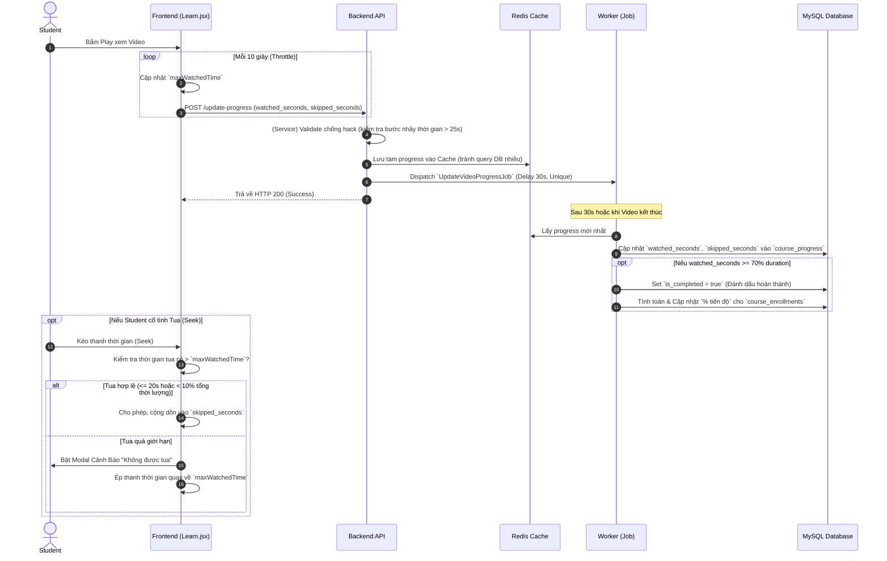
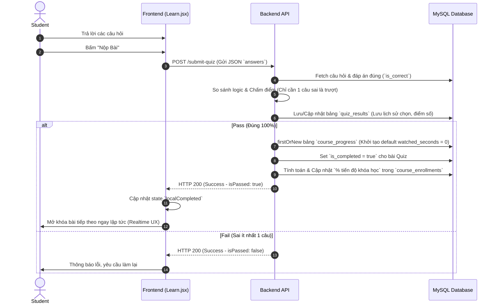

# Workflow Học Tập (Video & Quiz)

Tài liệu này mô tả chi tiết luồng xử lý (Workflow) của hệ thống học tập hiện tại, bao gồm cơ chế xem Video (tích hợp chống tua, đồng bộ tiến trình) và cơ chế làm bài trắc nghiệm Quiz.

---

## 1. Luồng Học Video (Video Lesson Workflow)

Hệ thống kết hợp cả **Frontend (UI/UX)** và **Backend (Redis + Queue + Database)** để đảm bảo trải nghiệm mượt mà, hạn chế gian lận và tối ưu hiệu năng ghi.

### Các điểm nhấn kỹ thuật (Video):
- **Debounce / Throttle:** Frontend chỉ gọi API 10s/lần. 
- **Queue & ShouldBeUnique:** Backend chỉ tạo 1 Job duy nhất chờ 30 giây mới chạy (giảm tải 80% truy vấn UPDATE vào Database).
- **Anti-Cheat (Chống gian lận):** 
  - Frontend dùng biến `maxWatchedTime` (đồng bộ từ DB) để chặn kéo thanh tua lên phía trước quá giới hạn cho phép.
  - Hỗ trợ cho phép tua tối đa 20s hoặc 10% bài học cho mục đích "bỏ qua đoạn giới thiệu ngắn".
  - Bắt lỗi bước nhảy thời gian lớn ở phía Backend Service.

---

## 2. Luồng Làm Trắc Nghiệm (Quiz Workflow)

Hệ thống Quiz đảm bảo bảo mật tuyệt đối: Frontend không bao giờ biết đáp án đúng, mọi thứ được chấm tại Backend.

### Các điểm nhấn kỹ thuật (Quiz):
- **Bảo mật đáp án:** Cột `is_correct` hoàn toàn được giấu trong các Response tải trang. Backend tự lôi ra để chấm.
- **Xử lý linh hoạt CourseProgress:** Vì bài Quiz không có thời lượng (duration) nên hệ thống tự động gán các chỉ số thời gian về `0` khi Insert vào bảng `course_progress` để tránh lỗi SQL Strict Mode, đồng thời bật flag `is_completed = 1` để qua bài.
- **Trải nghiệm tức thì:** Không giống Video (phải dùng Queue 30s), Quiz trả về kết quả ngay lập tức để học viên biết đỗ hay trượt và đi tiếp.
