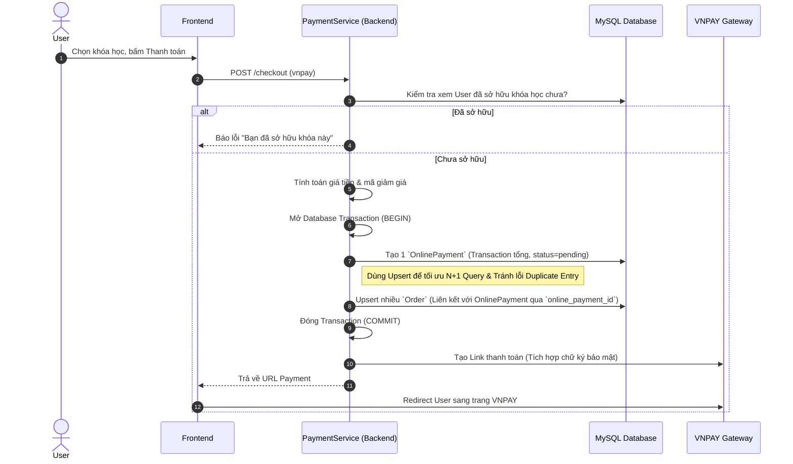
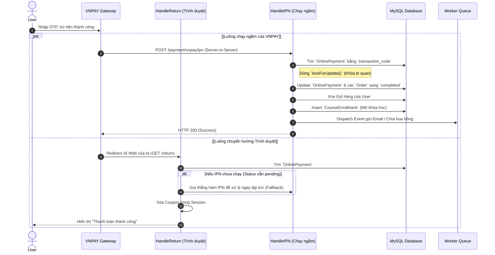

# Workflow Thanh Toán (Payment Workflow)

Tài liệu này đặc tả luồng xử lý thanh toán (Ví dụ: VNPAY, MoMo) của hệ thống. Luồng này đã được thiết kế lại theo tiêu chuẩn của các hệ thống E-commerce lớn, chống thất thoát tiền, xử lý lỗi Duplicate và chống đụng độ (Race condition).

---

## 1. Luồng Checkout (Người dùng bấm Thanh Toán)

---

## 2. Luồng Xử lý Kết quả (IPN và Return URL)

Đây là khâu quan trọng nhất để bọc lót chống lỗi mạng, chống cộng tiền 2 lần.

---

## 3. Các Điểm Tối Ưu Nâng Cao (Senior System Design)

### 3.1. Chống lỗi `Duplicate Entry` bằng `Upsert`
- **Bối cảnh:** Nếu khách bấm thanh toán nhưng tắt ngang (tạo ra order `pending`), lần sau bấm thanh toán lại sẽ bị lỗi MySQL `Duplicate key` do database cấu hình 1 user chỉ được 1 khóa học.
- **Giải pháp:** Sử dụng `Order::upsert()`. Nếu hệ thống phát hiện order `pending` đã tồn tại, nó sẽ không cố chèn thêm dòng mới mà sẽ **Cập nhật** lại mã `online_payment_id` và giá tiền của order cũ.

### 3.2. Khóa bi quan (Pessimistic Locking - `lockForUpdate`)
- **Bối cảnh:** Trình duyệt của khách (Return URL) và Server VNPAY (IPN) cùng gọi về hệ thống vào **cùng một phần nghìn giây (Race Condition)**.
- **Giải pháp:** Trong hàm IPN, câu lệnh `OnlinePayment::lockForUpdate()->first()` sẽ bắt truy vấn thứ 2 phải "đứng chờ" cho đến khi truy vấn 1 hoàn tất giao dịch Database, ngăn chặn triệt để việc mở khóa học 2 lần hay gửi email 2 lần.

### 3.3. Tối ưu Truy Vấn (Từ bỏ `LIKE`)
- **Bối cảnh:** Code cũ nối mã `-1, -2` và dùng câu lệnh SQL `LIKE` để tìm các order thuộc về một giao dịch. `LIKE` chạy rất chậm (Full table scan).
- **Giải pháp:** Tái cấu trúc DB: Dùng bảng `online_payments` làm giao dịch cha (Parent), các `orders` làm giao dịch con (Child) liên kết qua `online_payment_id`. Giờ đây chỉ cần dò đúng 1 mã `transaction_code` duy nhất bằng phép Bằng (`=`), sử dụng sức mạnh tối đa của Index Database.

### 3.4. Database Transaction
- **Giải pháp:** Toàn bộ quá trình tạo đơn (Tạo Payment -> Tạo các Order) và xác nhận đơn (Cập nhật Payment -> Cập nhật Order -> Tạo Enrollment) đều được bọc trong `DB::beginTransaction()` và `DB::rollBack()`. Lỗi ở bất cứ bước nào cũng trả DB về trạng thái sạch sẽ.
