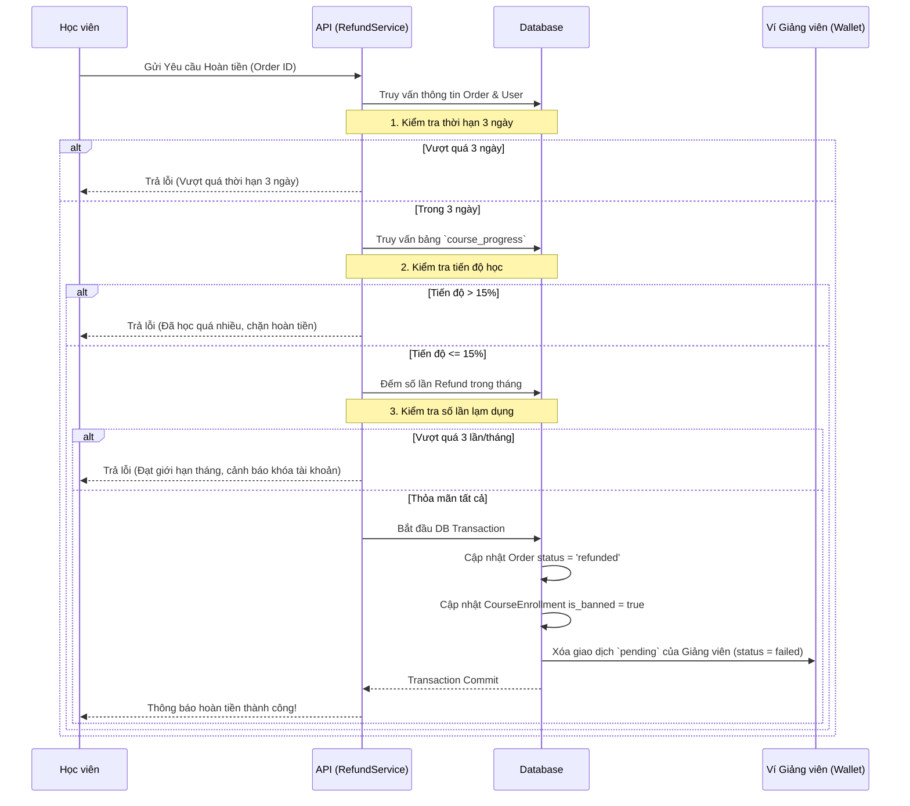
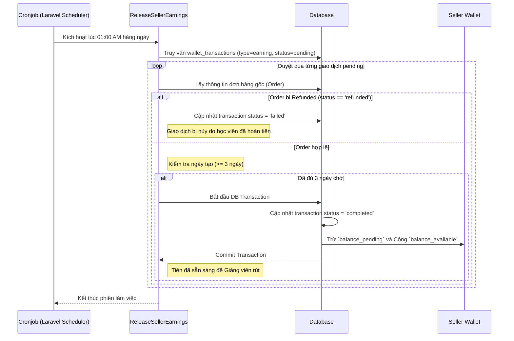

# WORKFLOW: HOÀN TIỀN VÀ GIẢI PHÓNG THU NHẬP (REFUND & SELLER EARNINGS RELEASE)

Workflow này mô tả chi tiết luồng nghiệp vụ xử lý hoàn tiền khóa học cho Học viên và giải phóng thu nhập cho Giảng viên.

## 1. Tác nhân tham gia (Actors)
- **Học viên (Student):** Người mua khóa học, có quyền yêu cầu hoàn tiền.
- **Hệ thống (EduFlow System):** Bao gồm Background Worker chạy Cronjob và API xử lý logic.
- **Giảng viên (Seller):** Người nhận doanh thu chia sẻ sau khi hết hạn refund.

## 2. Các quy tắc nghiệp vụ cốt lõi (Business Rules)
1. Thời hạn hoàn tiền: Tối đa 3 ngày kể từ khi thanh toán.
2. Điều kiện tiêu thụ: Tiến độ xem khóa học (`watched_seconds` / `total_duration_seconds`) phải dưới 15%.
3. Giới hạn lạm dụng: Một tài khoản Học viên chỉ được phép hoàn tiền tối đa 3 lần/tháng.
4. Giam thu nhập (Escrow): Thu nhập từ mỗi đơn hàng được lưu dưới dạng `pending` trong 3 ngày.
5. Giải phóng thu nhập: Tự động chạy mỗi đêm lúc 1:00 AM (`seller:release-earnings`) để chuyển tiền từ `pending` sang `available`.

## 3. Sơ đồ Luồng Hoàn Tiền (Refund Process Workflow)

## 4. Sơ đồ Luồng Giải phóng Thu nhập (Release Earnings Workflow)

Quá trình giải phóng doanh thu diễn ra âm thầm, không cần tương tác của người dùng.

