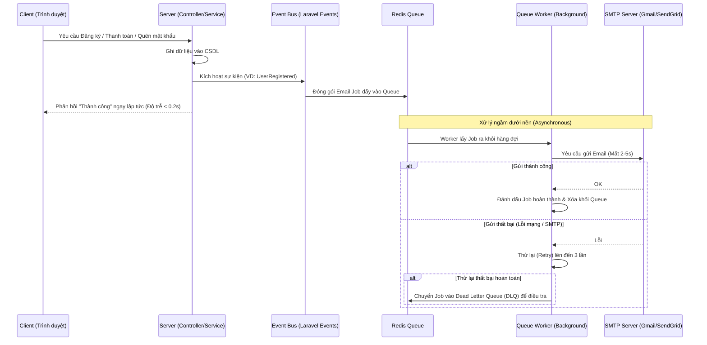

# WORKFLOW: LUỒNG GỬI EMAIL BẰNG QUEUE (ASYNCHRONOUS SENDMAIL)

Tài liệu này mô tả chi tiết luồng xử lý bất đồng bộ (Asynchronous) của việc gửi Email trong hệ thống EduFlow thông qua Message Queue. Luồng này giúp đảm bảo trải nghiệm người dùng (UX) không bị lag khi hệ thống kết nối ngoại vi (SMTP).

---

## 1. Kiến trúc tổng quan (Event-Driven & Queue)

Hệ thống sử dụng mô hình Hướng sự kiện (Event-Driven) kết hợp Hàng đợi (Queue) của Laravel.

## 2. Chi tiết các bước xử lý

### Bước 1: Kích hoạt sự kiện (Trigger)
- Khi một nghiệp vụ hoàn thành (ví dụ: người dùng thanh toán đơn hàng thành công), `Service` không gọi lệnh gửi mail trực tiếp.
- `Service` sẽ phát ra một sự kiện, ví dụ: `event(new OrderCompleted($order));`.

### Bước 2: Bắt sự kiện và Đưa vào hàng đợi (Dispatch to Queue)
- Một `Listener` (được implements `ShouldQueue`) sẽ lắng nghe sự kiện trên.
- Laravel tự động serialize (đóng gói) các object cần thiết (thông tin User, Order) và đẩy một **Job** vào Queue (lưu trữ trên Redis).
- Luồng chính của HTTP Request kết thúc tại đây và trả về Response cho người dùng ngay lập tức.

### Bước 3: Xử lý Hàng đợi (Queue Worker Processing)
- Tiến trình `php artisan queue:work` chạy ngầm (thường được quản lý bởi Supervisor trên server) sẽ phát hiện có Job mới.
- Worker lấy Job ra, giải mã dữ liệu và kết nối đến SMTP Server để gửi mail.
- Vì luồng này chạy hoàn toàn độc lập, nó có thể tốn 5s, 10s hoặc lâu hơn mà không hề ảnh hưởng đến người dùng đang duyệt web.

### Bước 4: Xử lý Lỗi và Thử lại (Error Handling & Retries)
- Giao tiếp với SMTP Server rất dễ bị lỗi (Timeout, rớt mạng).
- Cấu hình Worker sẽ cho phép **Retry 3 lần** (VD: `--tries=3`).
- Nếu sau 3 lần vẫn lỗi, Job đó sẽ bị rớt vào bảng `failed_jobs` (Dead Letter Queue) để Admin sau này có thể vào kiểm tra nguyên nhân và bấm nút gửi lại thủ công (Re-queue).
